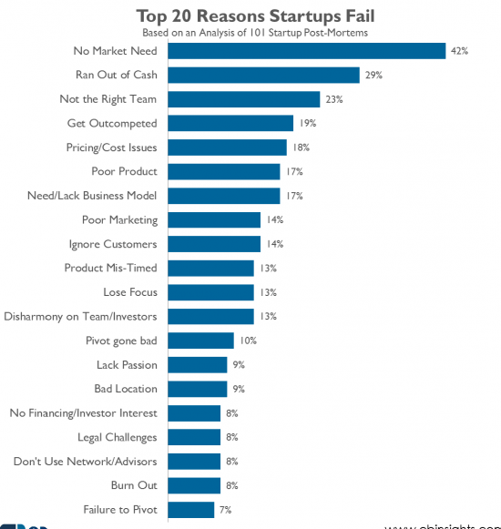

# Product & Market Fit

## CSC491, University of Toronto

---

### I asked a question on Twitter...

---

### And I got some interesting responses...

---

# What does this mean?

It means that you need to be intentional in figuring out how your product fits into the market. Do your research and position. Do not rely on chance.

---

# What is Product?

There's no shortage of results online...

---

# Give me the Tl;Dr

There are many areas of product in any given company. There's likely no exhaustive list because everyone does it a little bit differently.

The general idea is that you have a product to sell. How do you know it's the right product? How do you know if it's good? Are there customers for this product? Will they be willing to pay money? If not, who will pay money?

---

# Let's focus on 3 topics for discussion

---

# Let's focus on 3 topics for discussion

While product can encompass a lot more, we're going to talk about the basics: A vision that inspires your company, informs your product market fit, and what to do after you have all that, manage that product.

---

# Vision

---

# 1. Vision

The North Star has guided travelers for centuries. It is a reference point for which to position and "advise" your path forward.

---

# 1. Vision

## Core "mantra" of your company's product

## A "North Star" to help guide your decisions

## Tells us where to steer the ship and gives us directions

TODO: Examples of north star metrics, good and bad

---

# 2.Product Market Fit

## Finding your Product

> You don't find customers for your products. You find products for your customers.

_~ Seth Godin, author and former .com executive (https://seths.blog/2009/12/first-organize-1000/)_

---

# 2.Product Market Fit

---

# 2. Product Market Fit

- Finding product market fit is very difficult
- There is no exact science
- However, entrepreneurs work like scientists: use scientific method

---

# 2. Product Market Fit

## How do I know I got it?

Let's start with when you _don't_ have it.

- Customers aren't really understanding the value proposition
- Word of Mouth isn't happening
- Usage isn't growing
- Sales take a long time

When you do have it, many of the bullet points above are inversed. Also, sales and support staff become in high demand - and not because your product is complex/crappy, but because there's such an influx in customers!

---

# 2. Product Market Fit

You have a few components you need to work with. The major one is the market.

- If you have a great product, but no market, then you'll fail
- If you have a great product, there is a market, but no one wants to pay, you'll go bankrupt
- If you have a bad product, but there is a market and no competition, you may succeed but will be easily disrupted
- If you have a great product, an in-demand market, and people willing to pay - then you have a recipe for success. Unless...

---

# 2. Product Market Fit

The last component we'll talk about is the team. If you have a great product and all the stars align in the market, but you have a team without expertise, a lack of leadership, or if you fight - you'll fail just the same.

Your team is highly valuable and getting the right people is important. We'll talk more about this in another lecture.

---

# 3. Product Management

TODO

---

# Resources

## Articles

- [North Star Metrics answer by Carolyn Rose Kick on Quora](https://www.quora.com/What-is-North-Star-metric-for-startups)
- [North Star Metric Article on Forbes](https://www.forbes.com/sites/groupthink/2017/04/11/why-our-startup-needed-a-north-star-metric-and-how-we-found-it/#23e344344e40)
- [Product or Sales Article on Acquire.io](https://acquire.io/blog/startups-product-or-sales/)
- [What is Product Vision? on Aha.io](https://www.aha.io/roadmapping/guide/product-strategy/what-is-product-vision)
- [Why startups fail on Forbes](https://fortune.com/2014/09/25/why-startups-fail-according-to-their-founders/)
- [Odds of becoming a Unicorn are about 1%, and more insights on CBInsights](https://www.cbinsights.com/research/venture-capital-funnel-2/)

## Books

- [Shape Up, a Product/Project Management Guide by Basecamp](https://basecamp.com/shapeup)
